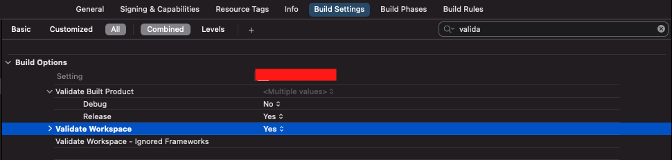

# Setup

* Create new XCode template using the SwiftUI Template
* Add frameworks to your project&#x20;
  * Carthage, CocoPods or manually
  * Swift Package Manager
* Add privacy items to info.Plist&#x20;
  * Camera Usage Description
  * Microphone Usage Description
* Add[ Background Mode](https://dolby.io/developers/interactivity-apis/tutorials/getting-started/quick-start)&#x20;
  * Audio, Airplay and Picture in Picture
  * Voice Over IP
* Validate workspace in the build settings to silence framework warnings for the Xcode Canvas.  Select your Project Target : Build Settings : Build Options: \
  Validate Workspace = **Yes**

